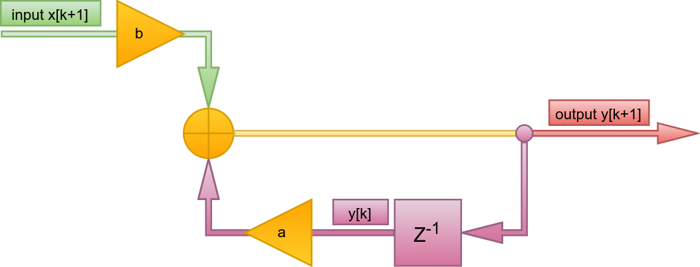
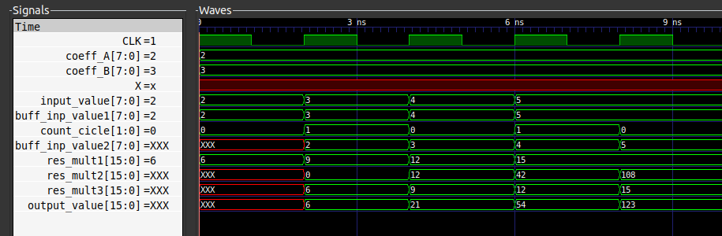

[](https://git.io/typing-svg)
  
# Оглавление
<div class = "intro">  

1. [Условие](#Условие) 
2. [Анализ](#Анализ) 
3. [Алгоритм](#Алгоритм)  
4. [Временные диаграммы](#Диаграммы)  
5. [Бит-совместимая модель](#модель)  

</div><br>


# Условие  
<p>
Реализовать БИХ фильтр вида y k+1 = a * y k +b * x k+1 . Размерность x, a,
b составляет 8 бит, знаковые целые числа. a, b известны заранее, в процессе работы не
меняются.
Обосновать размерность результата.
Данные на вход поступают каждый такт. Операция умножения занимает два такта.
</p>
<br>  

# Анализ
<p>  
Для лучшенго понимания работы фильтра на основе формулы была вполнена структурная схема. Входное значение текущего отсчета умножается на постоянный коэффициент, после чего суммируется с предидущим "задержанным" выходным отсчетом умноженным на константу. Данный реузльтат подается на выход фильтра.



___

Размерность результата данного фильтра считалась следующим образом:
1. Первый осчтет состоит из:   
    1. Входного значения - 8 бит умноженного на константу - 8 бит. Результат 16 бит. 
    * вышеуказанное выражение и будет выходным для первого отсчета.
2. Второй отсчет состоит из:
    1. Входного значения - 8 бит умноженного на константу - 8 бит. Результат 16 бит.    
    2. Задержанное первое значение - 16 бит умноженное на константу - 8 бит. Результат 24 бита.
    3. Сумма 24 бит и 16 бит даст результат в 24 бита.
3. Третий отсчет состоит из:
    1. Входного значения - 8 бит умноженного на константу - 8 бит. Результат 16 бит.    
    2. Задержанное первое значение - 24 бит умноженное на константу - 8 бит. Результат 32 бита.
    3. Сумма 24 бит и 16 бит даст результат в 24 бита.
и так далее...  

Исходя из такой логики, размерность выхода фильтра имеет динамическое значение и постоянно растет. Поэтому для тестирования модуля были взяты "небольшие" входные отсчеты и их количество равно 3.

```verilog
    initial begin
        $dumpfile("fourth_task_tb.vcd");
        $dumpvars(0, fourth_task_tb);
            
            #2
            op_1 = 8'b00000010; 
            #2;
            op_1 = 8'b00000011; 
            #2;
            op_4 = 8'b00000100; 
            #2;
            op_4 = 8'b00000101; 
            #2;
        
            $display("************** Test complete! **************");  
            $finish;
    end
```
Учитывая, значения входны отсчетов, можно констатировать, что для выходного провода и регистра, в котором хранится результат суммы хватит 16 битов. Для регистра, хранящего входное значение, умноженное на b хватит 16 бит, для регистра. который хранит задержанный результат, умноженный на а хватит 16 бит.

</p>


<br>  

# Алгоритм  

<br>  

# Диаграммы
<p>
Процесс работы модуля представлен на временных диаграмах ниже:
</p> 



Умножение занимает два такта. Модуль соотвествует условиям поставленным в задании.
<br>  


# Модель
<p>
Ниже продемострирован вывод модели фильтра. input_value - входные данные, delay_value - задержанное значение предидущего отсчета, output_value - отфильтрованное значение текущего входного отсчета.
</p>  

```shell
(base) ivan@ivan-filin:~/VerilogPractic/Fourth_task$ ./CompModel 
Coefficient`s: a = 2, b = 3 
input value: 2, delay value: 0
***** output value: 6 *****
input value: 3, delay value: 6
***** output value: 21 *****
input value: 4, delay value: 21
***** output value: 54 *****
input value: 5, delay value: 54
***** output value: 123 *****
(base) ivan@ivan-filin:~/VerilogPractic/Fourth_task$ 
```

Модель соотвествует условиям поставленным в задании.
<br>  
 
