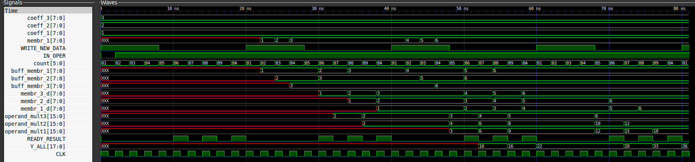

[](https://git.io/typing-svg)
  
# Оглавление
<div class = "intro">  

1. [Условие](#Условие) 
2. [Анализ](#Анализ) 
3. [Алгоритм](#Алгоритм)  
4. [Временные диаграммы](#Диаграммы)  
5. [Бит-совместимая модель](#модель)  

</div><br>


# Условие  
<p>
Реализовать КИХ фильтр, 3 отсчета, размерность 8 бит, знаковые числа. Вход поступает каждые 10 тактов, размерность 8 бит, знаковые целые числа.Допускается использовать один (два*) физический умножитель. Обосновать размерность
результата.
</p>
<br>  

# Анализ
<p>  

Фильтр с конечной импульсной характеристикой работает в соотвествии со следующей структурной схемой:


Каждое выходное значение является суммой входных значений умноженных на постоянные коэффициенты. Входные данные сдвигаются по регистрам в следствии чего образуется конвеер и новые входные значения вытесняют старые.
___

Исходя из структурной схемы фильтра и условия задания, для корректной работы модуля КИХ-фильтра трубется сформировать:
1. Массив (набор пронумерованных регистров) с постоянными коэффициентами фильтра
2. Массив (набор пронумерованных регистров) для хранения входных данных
3. Алгоритм сдвига входных значений по регистрам последовательно (конвейер)
____

Размерность результата расчитывается следующим образом:
1. Входные данные изначально имеют размерность в 8 бит
2. После умножения на 8 битовый коэффициент реезультат произведения будет иметь размер уже 16 бит
3. Сложение трех 16 битных чисел производится так:   
    1. Сложение первых двух 16 битных чисел даст 17 битный результат
    2. Третье число перекладывается в 17 битный регистр
    3. Два 17 битных регистра при сложении дадут 18 битный результат

Итог: выходные значения после фильтрации будут иметь размерность в 18 бит.

</p>
<br>  

# Алгоритм  

<p>
 Алгоритм работы фильтра представлен ниже:  
</p>

<div class = "intro">  

1. Выставляем сигнал WRITE_NEW_DATA на один такт каждые 10 тактов. Когда данный сигнал имеет значение лог.1 производится запись новых членов входной последовательности в регистры
2. После выводим сигнал IN_OPER  в лог.1. Этот сигнал разрешает вход в арифметический вычислитель.
3. После производится проверка регистров сдвига (те которые имеют индекс d) на "повисание в воздухе". Если проверка пройдена, то по значению счетчика сдвига производится присовение операндам умножения определенных значений.
    1. Готовность результата сообщает выставленный в лог.1 сигнал READY_RESULT.
5. После производится операция умножения, результат которой в зависимости от значения счетчика вывода суммы присваивается операндам сложения.
6. Последним действием производится присваивание суммы выходному проводу Y_ALL.
    
</div>  
<br>  

# Диаграммы
<p>
Процесс работы модуля представлен на временных диаграмах ниже:
</p>  


<p>
Выходные отсчеты имеют слудующую последовательность: 10, 16, 22, 28.   

Результат работы модуля полностью соответсвует заданному начальному условию.
</p>  
<br>  


# Модель
<p>
Бит-совместимая модель была написана на языке программирования C++. Модель, как и модуль получает на вход 3 числа, результат представляет собой 1 число. Результат работы модели в консоли представлен ниже:  


```shell
base) ivan@ivan-filin:~/VerilogPractic/Thrid_task$ ./CompModel 

Coefficient's: 1 2 3
3 2 1 
 Output result: 10
4 3 2 
 Output result: 16
5 4 3 
 Output result: 22
6 5 4 
 Output result: 28
(base) ivan@ivan-filin:~/VerilogPractic/Thrid_task$ 
```
</p>

<p>
Результат работы модели полностью соответсвует заданному начальному условию.
</p>  

<br>  
 
